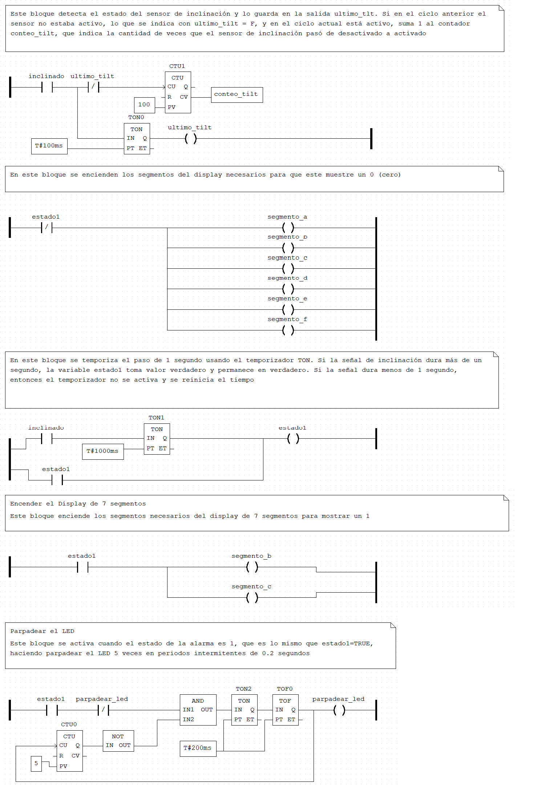

# ⚙️ Laboratorio N°2: Reimplementación de Lazo de Control en OpenPLC (Ladder Diagram)

## 📌 Contexto del Proyecto

Este proyecto forma parte de la asignatura **Tecnologías para la Automatización** de la **Ingeniería en Sistemas de Información** de la **Universidad Tecnológica Nacional (UTN) - Facultad Regional Resistencia**.

El objetivo de este laboratorio fue **reimplementar al menos un lazo de control** del sistema antirrobo de la chipacería "Chispita Caliente", desarrollado originalmente en el Laboratorio N°1, utilizando **OpenPLC** sobre un microcontrolador **Raspberry Pi Pico W** y programando en el lenguaje **Ladder Diagram (LD)**.

### 👥 Integrantes
* Costantin Maria Belen
* Cornalo Maria Laura
* Insaurralde Franco
* Maidana Maria Fatima
* Ojeda Brian
* **Año:** 2025

***

## Situación Problemática

El problema central es que los empleados consumen el producto (chipacitos) sin autorización en la chipacería **Chispita Caliente** de Resistencia, Chaco. Para resolverlo, se implementó un sistema casero antirrobo que detecta y alerta sobre la manipulación de la caja utilizando sensores y un microcontrolador.

## Lazo de Control Reimplementado: Detección de Inclinación (Lazo 1)

El lazo seleccionado para la reimplementación en PLC es el Lazo 1, que detecta la inclinación de la caja.

### 📝 Fin del Programa

El programa en LD busca detectar la activación continua del sensor de inclinación (`Tilt Switch`) por un período de al menos **un segundo** para activar el **Estado de Alerta 1**.

### 🚨 Acción en Estado de Alerta (Estado 1)

Al activarse la variable `estado1` (TRUE):
1.  El **Display de 7 Segmentos** muestra un **"1"**.
2.  El **LED de Alarma** parpadea **5 veces** en ciclos intermitentes de **0.2 segundos** (0.2s ON, 0.2s OFF).

***

## ⚙️ Mapeo de Entradas y Salidas (I/O Mapping)

Esta tabla muestra la asignación de las variables lógicas a las direcciones de memoria de OpenPLC para la Raspberry Pi Pico W:

| Tipo | Variable | Dirección | Tipo de Dato | Pin GPIO | Componente Físico |
|:---:|:---|:---|:---:|:---:|:---|
| Entrada | `inclinado` | `%IX1.2` | BOOL | GP12 (user\_din[6]) | Tilt Switch |
| Salida | `parpadear_led` | `%QX0.7` | BOOL | GP21 (user\_dout[7]) | LED de Alarma |
| Salida | `segmento_a` | `%QX0.0` | BOOL | GP14 (user\_dout[0]) | Segmento A del Display |
| Salida | `segmento_b` | `%QX0.1` | BOOL | GP15 (user\_dout[1]) | Segmento B del Display |
| Salida | `segmento_c` | `%QX0.2` | BOOL | GP16 (user\_dout[2]) | Segmento C del Display |
| Salida | `segmento_d` | `%QX0.3` | BOOL | GP17 (user\_dout[3]) | Segmento D del Display |
| Salida | `segmento_e` | `%QX0.4` | BOOL | GP18 (user\_dout[4]) | Segmento E del Display |
| Salida | `segmento_f` | `%QX0.5` | BOOL | GP19 (user\_dout[5]) | Segmento F del Display |
| Salida | `segmento_g` | `%QX0.6` | BOOL | GP20 (user\_dout[6]) | Segmento G del Display |

***

## 💻 Implementación en Ladder Diagram (LD)

### Diagrama Ladder Diagram del Lazo 1

El siguiente diagrama muestra el código implementado en OpenPLC Editor:

### 1. Bloque de Conteo de Activaciones (`CTU1`, `TON0`)

**Función:** Contabilizar las veces que el sensor de inclinación pasa de **desactivado a activado** (`flanco de subida`).
* Utiliza el contacto `inclinado` y el contacto negado de `ultimo_tilt` para detectar el flanco positivo y activar el contador `CTU1`.
* El temporizador `TON0` (PT: T#100ms) se utiliza para guardar el estado actual de `inclinado` en la bobina `ultimo_tilt`, usándolo como estado anterior en el siguiente ciclo.
* El contador `CTU1` incrementa `conteo_tilt` hasta un valor de 100 (PV).

### 2. Bloque de Muestra de Estado Normal ("0")

**Función:** Encender los segmentos del display para mostrar el dígito **"0"** mientras el sistema no esté en alerta (`estado1 = F`).
* Un contacto **negado** de `estado1` (`|/| estado1`) energiza los segmentos **`a`**, **`b`**, **`c`**, **`d`**, **`e`** y **`f`**.

### 3. Bloque de Detección de Inclinación Sostenida (`TON1`)

**Función:** Detectar si la señal del sensor `inclinado` se mantiene por más de **1 segundo**.
* El temporizador a la conexión **`TON1`** (PT: T#1000ms) se activa con la señal `inclinado`.
* Si el tiempo se excede, la salida **Q** se activa y enclava la bobina `estado1`, llevando el sistema a la Alarma (Estado 1).

### 4. Bloque de Muestra de Estado de Alerta ("1")

**Función:** Encender los segmentos del display para mostrar el dígito **"1"** al activarse `estado1`.
* Un contacto de `estado1` (`| | estado1`) energiza solo los segmentos **`b`** y **`c`** para formar el dígito "1".

### 5. Bloque de Parpadeo del LED (Alarma Visual)

**Función:** Hacer parpadear el LED de alarma (`parpadear_led`) **5 veces** con un ciclo de 0.4 segundos (0.2s ON, 0.2s OFF).
* El contador **`CTU0`** (PV: 5) lleva la cuenta de los ciclos de parpadeo.
* La lógica de encendido y apagado se logra con el temporizador a la conexión **`TON2`** y el temporizador a la desconexión **`TOF0`**, ambos con un tiempo de **T#200ms**.
* La lógica **AND** permite el parpadeo solo si `estado1` es TRUE y el contador `CTU0` aún no ha llegado a 5 (uso de bloque **NOT** en la salida del contador).

***

## ⚠️ Limitaciones de la Implementación en OpenPLC (Pico W)

La "traducción" a PLC presenta restricciones que impidieron la reimplementación completa del TP1:

* **Mapeo de Pines Rígido:** Los pines GPIO en la implementación de OpenPLC para la Pico W son menos flexibles, con funciones de entrada o salida predefinidas, lo que obligó a modificar la disposición de pines original.
* **Ausencia de Networking/Serial:** No fue posible implementar la funcionalidad de **Control Serial** (`status`, `reset`) ni la comunicación por **MQTT** o **HTTP**, ya que OpenPLC no proporciona acceso a estas capacidades en el microcontrolador.
* **Alcance:** Debido a lo anterior, el proyecto se limitó a reimplementar únicamente el **Lazo 1** (Detección de Inclinación).

***

## ▶️ Cómo Ejecutar el Proyecto

### Requisitos
- **Raspberry Pi Pico W** con el firmware de OpenPLC Runtime cargado.
- **OpenPLC Editor** para compilar y cargar el programa (archivo `plc.xml`).
- **Cable micro USB** para conexión.

### Pasos de Ejecución
1.  Asegurar que el **Raspberry Pi Pico W** tenga el Runtime de OpenPLC activo.
2.  Cargar el código fuente (`plc.xml`) en OpenPLC Editor y compilarlo.
3.  Cargar el programa compilado en el microcontrolador.
4.  Manipular el **Tilt Switch** (conectado a `%IX1.2` / GP12) por más de 1 segundo para observar el cambio al Estado 1.
5.  Observar el display mostrando el "1" y el LED parpadeando 5 veces.

***
[Enlace al repositorio git: https://github.com/dbbojeda-hue/PLC-lab.git]
